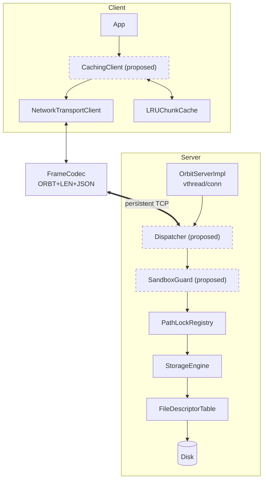
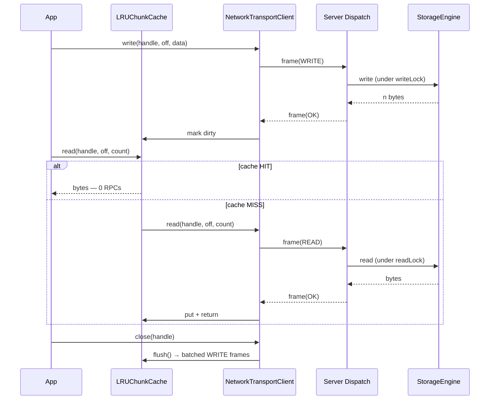

# OrbitFS — Technical Design

Full context: `README.md` for overview, `OrbitFS_Technical_Specification.pdf` (repo root) for original spec.

---

## 1. Wire protocol

Every message is a frame:

```
MAGIC (4B, 0x4F524254 = "ORBT")  |  LENGTH (4B, big-endian)  |  JSON payload
```

- `FrameCodec` rejects bad magic, truncation, and empty streams with `IOException` — fails fast instead of misparsing.
- `RPCRequest(requestId, method: RpcMethod, path, fd, offset, count, dataBase64)`
- `RPCResponse(requestId, status, errorCode, bytesProcessed, fd, dataBase64, stat)`
- `method` is a typed enum, not a raw string — gives the server's dispatch `switch` compile-time exhaustiveness. Wire format unaffected (Jackson serializes enum as name).
- `PING`/`PONG` = connectivity health check, not a data-path op.

**Spec deviations (deliberate):** Gradle not Maven; `OrbitServerImpl` not `OrbitFSServer`. Cosmetic, not functional.

---

## 2. Concurrency model

**Server — one virtual thread per connection.** Blocking I/O code stays simple; the JVM parks the carrier thread instead of holding an OS thread per client. Rule: never pool virtual threads, avoid long `synchronized` blocks (pins the carrier). `LRUChunkCache`'s `synchronized` methods are short in-memory ops — accepted exception.

**Client — one persistent connection, multiplexed.** Each request gets a `requestId` + a `CompletableFuture`, tracked in a `ConcurrentHashMap`. A dedicated read loop decodes responses and completes the matching future. Writes to the socket are synchronized; everything else runs concurrently — many requests in flight on one socket.

- Timeout (10s default) / error / interrupt → `RuntimeException`, future always cleaned up.
- `close()` is idempotent: fails pending futures, closes socket, interrupts reader.

**⚠️ Resolved:** `OrbitServerImpl.handleConnection` now decodes `RPCRequest` frames via `FrameCodec` and dispatches to `StorageEngine`. The client and server can communicate end-to-end. A `Map<RpcMethod, handler>` replaces the old switch for extensibility. PathLockRegistry provides per-path locking around engine calls.

Still pending: Phase 1/2 proof tests (50×PING timing, 10W/20R corruption), cache-in-client wiring, security sandbox.

---

## 3. Storage layer

- **`FileChannelHandle`** — owns a `FileChannel`, opened eagerly (`CREATE,READ,WRITE`). ID = `path + "_" + UUID`. Tracks its own read/write stats.
- **`FileDescriptorTable`** — `ConcurrentHashMap` of handle ID → handle. Deregisters on close; further ops on a closed handle throw `FileChannelNotFoundException`.
- **`StorageEngine`** — the single entry point (open/read/write/seek/stat/close), delegating down to the table and handles.
- **`PathLockRegistry`** — canonical-path (`toAbsolutePath().normalize()`) → `ReadWriteLock`. Self-cleaning: a path's entry is removed once its last holder releases it.

**Exceptions:** `OrbitFSException` → `StorageException` → `StorageIOException` / `HandleNotFoundException` → `FileChannelNotFoundException`. Small, specific set for dispatch to map to error codes.

---

## 4. Client cache

`LRUChunkCache` — 64KB chunks, `LinkedHashMap` (access-order) + `removeEldestEntry` for LRU, `synchronized` throughout.

- `put` = clean chunk, `write` = dirty chunk, `get` = null on miss.
- `flush()` returns dirty chunks as `DirtyChunk`s, clears dirty flags.
- `invalidate(path)` — prefix removal. `close()` — flush + clear, idempotent.

**Fully built and tested standalone — not yet wired into `NetworkTransportClient`.** No caching decorator exists yet; reads still always hit the server. Target once wired: 1000 reads over one 64KB file → 1 RPC.

---

## 5. Known issues

**🔴 Unlock via the returned `Lock`, never by path.** `unlockRead(path)`/`unlockWrite(path)` re-resolve the map at unlock time — unsafe, because the registry may have already cleaned up and recreated that path's entry. Causes either a wrong-instance `IllegalMonitorStateException` or a silently leaked hold that starves a writer. This caused real intermittent test failures before being root-caused. **Fix + convention:** `LockResult.lock().unlock()` releases the exact instance held, safely. Always use this — never re-resolve by path.

**🟡 `OrbitSerializer`'s lazy `ObjectMapper` init isn't synchronized.** Benign today; tighten if the file is touched for other reasons.

**🟡 A retained `FileChannelHandle` can reopen after close.** `StorageEngine` prevents use-after-close at the table level, but a caller holding the handle object directly bypasses that. Don't retain handles past close.

---

## 6. Tests

40 passing. Notable coverage: frame codec corruption cases (bad magic / truncated / empty); 50-thread × 20-iteration lock stress test; 20-way concurrent request multiplexing over one socket; cache LRU eviction + dirty/flush cycle; full open→write→read→stat→close round-trip through the real server dispatch.

---

## 7. Roadmap

1. **Server dispatch → frames** (next, unblocks all below)
2. Run spec's Phase 1/2 proofs (50× concurrent PING timing; 10 writer / 20 reader corruption check)
3. Wire `LRUChunkCache` into the client, verify 1-RPC target
4. Security sandbox: virtual root, path traversal rejection, frame size cap, hidden-file block — **see Capsule project**
5. Docs + end-to-end demo

### Mobile / cross-platform use (Android TV, phones)
Library API is the primary surface — no FUSE (root-reliant on Android) or CLI (awkward on TV remote). Apps depend on `orbitfs-core` directly and call `OrbitFSClient` Java/Kotlin methods. Optional: small Android lifecycle wrapper to manage connect/close around app pause/resume.

---

## 8. Diagrams

### Component architecture
Dashed = proposed, not built.



### Request flow — write, then read (hit vs. miss)
Assumes cache wired in (§4, §7 step 3).

