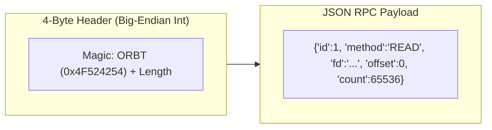
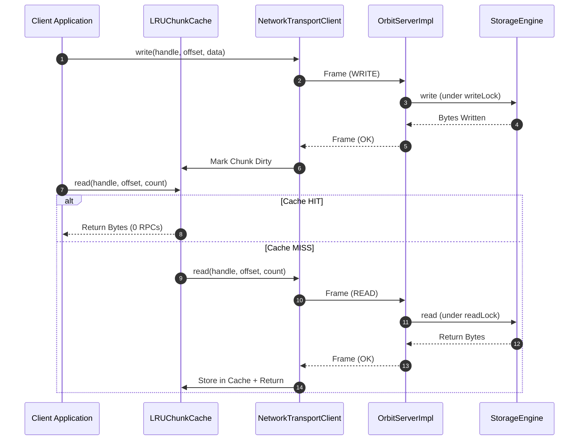
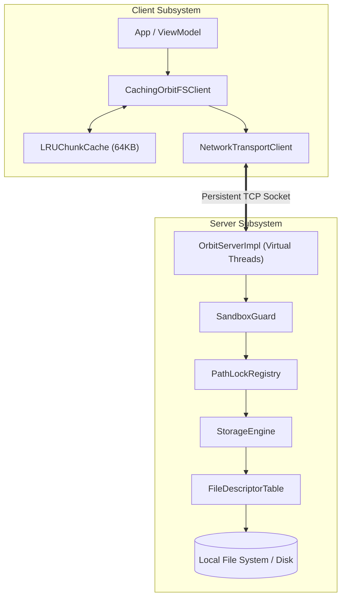

# OrbitFS Core — Technical Design & Protocol Specification

## 1. Wire Protocol & Message Framing

OrbitFS communicates over raw TCP sockets using a 4-byte length-prefixed binary header followed by a minified JSON command payload.

```mermaid
graph LR
    subgraph Header["4-Byte Header (Big-Endian Int)"]
        H["Magic: ORBT (0x4F524254) + Length"]
    end
    subgraph Payload["JSON RPC Payload"]
        P["{'id':1, 'method':'READ', 'fd':'...', 'offset':0, 'count':65536}"]
    end
    Header --> Payload
```

- `FrameCodec`: Rejects bad magic header, truncation, and empty streams with `IOException` for fast-fail security.
- `RPCRequest(requestId, method: RpcMethod, path, fd, offset, count, dataBase64)`
- `RPCResponse(requestId, status, errorCode, bytesProcessed, fd, dataBase64, stat)`
- `RpcMethod`: Typed Java enum (`PING`, `OPEN`, `READ`, `WRITE`, `STAT`, `LIST`, `DELETE`, `CLOSE`).

---

## 2. Concurrency & Socket Threading Model

### Server Architecture
Uses Java 21 **Virtual Threads** (`Thread.ofVirtual()`) for per-connection handling. Blocking I/O code remains simple while the JVM parks carrier threads efficiently during socket wait states without OS thread pool sizing constraints.

### Client Multiplexing
Uses a single persistent TCP connection with multiple in-flight asynchronous requests mapped via atomic `requestId` futures in a `ConcurrentHashMap`.

```mermaid
sequenceDiagram
    autonumber
    participant App as Client Application
    participant Cache as LRUChunkCache
    participant NTC as NetworkTransportClient
    participant Disp as OrbitServerImpl
    participant Eng as StorageEngine

    App->>NTC: write(handle, offset, data)
    NTC->>Disp: Frame (WRITE)
    Disp->>Eng: write (under writeLock)
    Eng-->>Disp: Bytes Written
    Disp-->>NTC: Frame (OK)
    NTC->>Cache: Mark Chunk Dirty

    App->>Cache: read(handle, offset, count)
    alt Cache HIT
        Cache-->>App: Return Bytes (0 RPCs)
    else Cache MISS
        Cache->>NTC: read(handle, offset, count)
        NTC->>Disp: Frame (READ)
        Disp->>Eng: read (under readLock)
        Eng-->>Disp: Return Bytes
        Disp-->>NTC: Frame (OK)
        NTC->>Cache: Store in Cache + Return
    end
```

---

## 3. Storage Layer & Path Locking

- **`FileChannelHandle`**: Wraps a `FileChannel` opened eagerly (`CREATE, READ, WRITE`). Handle ID = `path + "_" + UUID`.
- **`FileDescriptorTable`**: `ConcurrentHashMap` mapping Handle ID to `FileChannelHandle`. Deregisters handles on close.
- **`StorageEngine`**: Single entry point for all file operations (`open`, `read`, `write`, `seek`, `stat`, `close`).
- **`PathLockRegistry`**: Maps canonical path to `ReadWriteLock` for per-path concurrency control. Multiple readers execute concurrently while writers obtain exclusive locks.
- **`SandboxGuard`**: Resolves relative and absolute path handles within `sandbox.root`, rejecting path traversal attempts (`../`).

---

## 4. Component Architecture Diagram

```mermaid
flowchart TB
    subgraph ClientSub["Client Subsystem"]
        App["App / ViewModel"] --> CClient["CachingOrbitFSClient"]
        CClient <--> Cache["LRUChunkCache (64KB)"]
        CClient --> NTC["NetworkTransportClient"]
    end

    NTC <== "Persistent TCP Socket" ==> ServerNode

    subgraph ServerEngine["Server Subsystem"]
        ServerNode["OrbitServerImpl (Virtual Threads)"] --> Guard["SandboxGuard"]
        Guard --> Locks["PathLockRegistry"]
        Locks --> Engine["StorageEngine"]
        Engine --> FDT["FileDescriptorTable"]
        FDT --> Disk[("Local File System / Disk")]
    end
```

---

## 5. Known Issues & Maintenance

- **PathLockRegistry Lock Holding**: Always unlock using `LockResult.lock().unlock()` rather than re-resolving by path string to avoid wrong-instance monitor state exceptions.
- **FileChannelHandle Scope**: Avoid retaining handle references past `close()` to prevent out-of-order handle operations.
