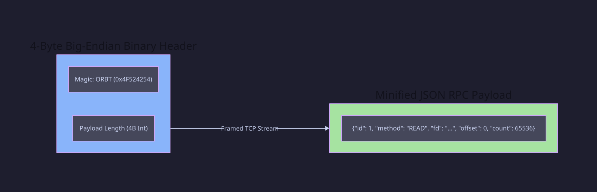
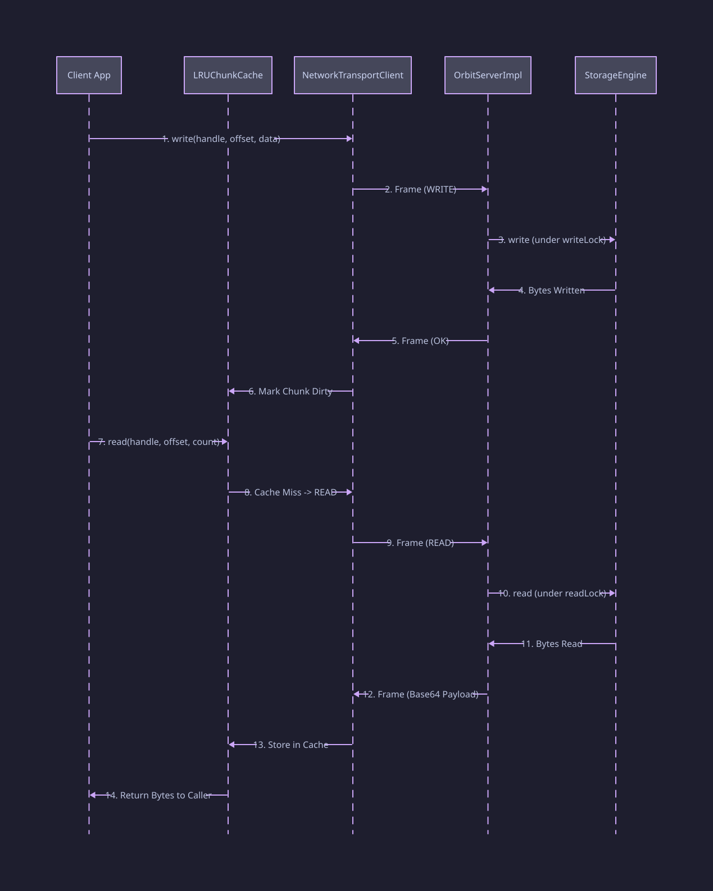

# OrbitFS Core — Technical Design & Protocol Specification

> *Full technical design, framing protocol, sequence diagrams, and security specifications are located in [docs/DESIGN.md](docs/DESIGN.md).*

---

## 1. Wire Protocol & Message Framing

OrbitFS communicates over raw TCP sockets using a 4-byte length-prefixed binary header followed by a minified JSON command payload.

---

## 2. Read/Write Sequence Flow

---

## 3. Complete Specification Index

- [Low-Level Design & Protocol Spec (docs/DESIGN.md)](docs/DESIGN.md)
- [System Architecture & Threading Model (docs/ARCHITECTURE.md)](docs/ARCHITECTURE.md)
- [Engine Feature Specification (docs/FEATURES.md)](docs/FEATURES.md)
- [API & CLI Guide (docs/API_AND_CLI.md)](docs/API_AND_CLI.md)
