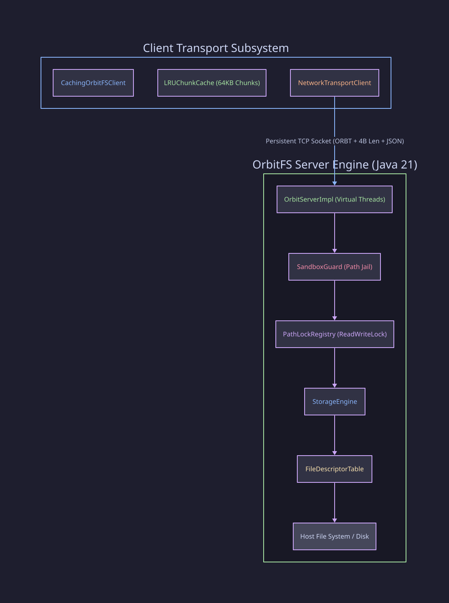

# OrbitFS Core — System Architecture & Threading Model

## 🏗️ System Architecture Overview

OrbitFS Core is designed as a layered, modular storage engine that handles framed TCP sockets, path-level concurrency, and file channel I/O.

---

## 🧩 Subsystem Breakdown

### 1. Transport & Wire Layer (`org.orbitfs.common`)
- **`FrameCodec`**: Encodes and decodes length-prefixed `ORBT` message frames over raw TCP streams.
- **`RPCRequest` & `RPCResponse`**: Java records representing immutable, minified JSON RPC requests and responses.
- **`RpcMethod`**: Typed Java enum defining supported RPC opcodes (`PING`, `OPEN`, `READ`, `WRITE`, `STAT`, `LIST`, `DELETE`, `CLOSE`).

### 2. Server & Dispatch Engine (`org.orbitfs.server`)
- **`OrbitServerImpl`**: Multi-threaded socket listener using Java 21 `Thread.ofVirtual()` per connection. Dispatches decoded requests to functional handler maps.
- **`SandboxGuard`**: Security path jail ensuring files cannot escape the server root.
- **`PathLockRegistry`**: Thread-safe `ReadWriteLock` registry providing path-level read/write locking.
- **`StorageEngine`**: Main facade delegating file operations (`open`, `read`, `write`, `seek`, `stat`, `close`) to the underlying file descriptor table.
- **`FileDescriptorTable`**: Concurrent hash map tracking active `FileChannelHandle` instances by session UUID.

### 3. Client Transport & Caching (`org.orbitfs.client`)
- **`NetworkTransportClient`**: Persistent TCP socket client supporting multiplexed asynchronous RPC requests via atomic `requestId` futures.
- **`CachingOrbitFSClient`**: Decorator combining `NetworkTransportClient` with `LRUChunkCache` for 64KB chunk write-back caching.
- **`LRUChunkCache`**: Thread-safe 64KB chunk buffer with LRU eviction policy.

---

## 🔄 Threading & Concurrency Guarantees

- **Server Connection Isolation**: Every connected client socket runs on its own Java 21 Virtual Thread.
- **Concurrent Non-Blocking Reads**: Multiple virtual threads can execute `READ` on the same file concurrently via `PathLockRegistry.readLock()`.
- **Exclusive Atomic Writes**: `WRITE` operations acquire `PathLockRegistry.writeLock()`, ensuring thread-safe disk writes.
